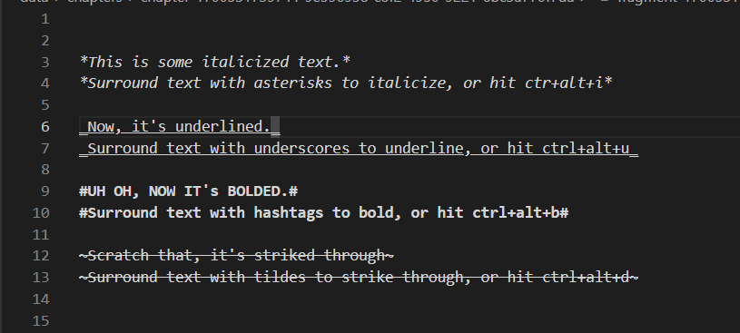
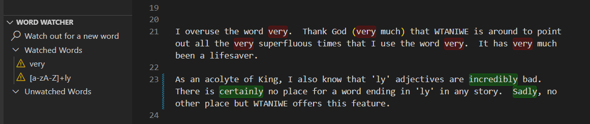
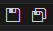
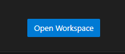
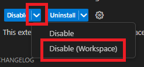
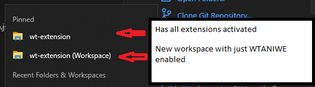

# Writing Tool -- An Integrated Writing Environment (WTANIWE)  README

This is the README for your extension  Writing Tool -- An Integrated Writing Environment (WTANIWE) ".  An extension tailor made to write fiction and prose in VSCode, from start to finish including: importing old work, tracking via git, and exporting into industry formats.

## Features

### Git tracking

Let's be honest, Google Docs and Microsoft Word version tracking is... flimsy at best.  It never seems to save a revision at the spot you wanted and it hardly ever has enough of a revision history for you to get an accurate view of the old version you're looking for.

WTANIWE uses git.  You probably don't need me to explain much else.  Save revisions of your work how you want to, where you want to.  See exact diffs between the text.

### Importing Work from outside sources

If you've gotten this far, you probably have some writing sitting in other document repositories that you don't want to entirely re-write if you switch to WTANIWE.  

WTANIWE offers *extensive* features for importing from many sources, including `.docx`, `.odt`, `.html`, and `.md`.

Once WTANIWE is installed, run the command `wt.walkthroughs.openIntro` or open the Introduction Walkthrough from the welcome screen for more information about importing from outside source.

### IntelliSense-based synonyms
 
### MarkDown-like styling tailored specifically to writing

More details on this below, but the basics is that WTANIWE uses MarkDown-like text styling to quickly insert obvious demarkations of stylized text.  Stylizations such as \**italics*\*, ^**bolds**^, \~~~strike throughs~~\~, and \_underlines\_ (uh oh that one doesn't exist in MarkDown).

### TODO tracking

Mark areas of text you want to come back to later with square brackets.  All TODOs are stored in an organized tree panel to immediately jump to later.

### Text-to-Speech

### Exporting Work

## Working with Writing Tool fragment files (.wt and .wtnote)

There are two new file types introduced and mainly used in this extension, .wt fragment files and .wtnote note files.  

Fragment files are the main documents you will be writing in and they are meant to represent specific, named "fragments" of text.  When importing outside work, all work will be converted into WT fragments.  And when exporting WT into outside file types, the fragments of your project will be stitched together and converted into outside file types.  

WT Note (.wtnote) files have all the same advantages of .wt fragment files, but they are used only for note taking.

Here are some of the tools built specifically for .wt and .wtnote files.

### Styling

As mentioned above, WTANIWE uses similar text styling conventions as MarkDown, however they have been modified, reduced, and tailored specifically towards writing.

Specifically, I did not use the conventional MarkDown styling for .wt and .wtnote files because, honestly, there is a lot of clutter in MarkDown.  WTANIWE is not here to write research papers or cleanly display code and data, it is here for writing.

By eschewing the prebuilt fluff of MarkDown, it becomes easy to focus in on the necessary text styling for writing only and give the best experience for those.  For example, automatically toggling styling to selected text or inserting/removing style marks at cursors, and showing the text styling *on the document* itself, without having to open a preview window.

These are the style options:

- **Italics:** Like markdown, you can italisize text by surrounding it with astericks \*\* (*like this*).  \*This text would be italisized in WTANIWE\*

    > Hit ctrl+alt+i to surround selected text with italics or insert italics at the cursor.

- **Bold:** Double astericks vs single astericks is harder to query for when doing on-the-fly text styling, so I have opted to bold items with carets ^^.  ^This text would be bolded in WTANIWE^.

    > Hit ctrl+alt+b to surround selected text with bold or insert bold at the cursor.

- **Strikethrough:** Strikethrough is a non-standard MarkDown styling and doesn't exist in all environments.  Where it does exist, it uses double tildes to denote strikethrough (~~like this~~).  In WTANIWE, I have swapped that to only using a single tilde ~~.  ~This text would be strikedthrough in WTANIWE~

    > Hit ctrl+alt+d to surround selected text with strikethrough or insert strikethrough at the cursor.

- **Underline:** Underline is not used in MarkDown.  To underline in WTANIWE, surround text with underscores __.  \_This text would be underlined in WTANIWE\_.

    > Hit ctrl+alt+u to surround selected text with underlines or insert underlines at the cursor.

Example: 
  
  > 

### Navigation

Something no other writing editor I have tried does is custom keybindings for nevigating text, and, honestly, this is a game changer.  If you've found this extension, chances are you know a thing or two about programming, and you know that navigating code with shortcuts is a blessing.  So why not navigating sentences in prose in the same way?

Features:

- **Sentence jumping:** To jump around in sentences use `ctrl+[` to jump `forward` in the text and `ctrl+]` to jump `backward` in the text.  Add shift to highlight as well.

- **Clause/Sentence fragment jumping:** To jump around not only in sentences (meaning stopping at puntuation like '.', '!', and '?') but in the clauses within those sentence use `alt+[` to jump `forward` in the text and `alt+]` to jump `backward` in the text.  Add shift to highlight.

- **Paragraph jumping:** To jump around entire sentence use `ctrl+alt+[` to jump `forward` in the text and `ctrl+alt+]` to jump `backward` in the text.  Add shift to highlight.

Example:

  >  

#### Dictionary

Misspelled words are highlighted in red.  If you want to prevent certain words from being detected as misspelled, you can also add them to a personal dictionary.

#### Word Watcher

If you know you have certain 'problem' words that you want to avoid, use word watching to automatically highlight all instances of that word in your text.

For example, the word 'very' and all words that end with 'ly' are automatically added to the word word watched on WTANIWE workspace creation.  And will be highlighted as shown.

  > 

In addition, you can assign certain colors to specific watched words.  To know which pattern is being matched on sight.

## Requirements

VSCode must be kept up-to-date for access to all features.  VSCode often has the habit of introducing new features or breaking old features with their updates and I am always trying to stay ahead of the break-fix, break-fix cycle.  To have a fully-functional WTANIWE experience, enable automatic updates on VSCode.

Some features only function when your machine has external dependancies installed:

- Currently, text-to-speech only works on Windows machines with PowerShell installed and up-to-date.
  - There are no plans to develop this on Linux as all Linux text-to-speech libraries I have tried seem to be lacking.
  - There are currently no plans to develop this for Mac as I do not own a Mac.
  - If anyone wants to develop TTS for these platforms, please make a PR.
- To do imports or exports of .odt files, libreoffice must be installed on your machine
  - On Windows, please install with the [libreoffice msi](https://www.libreoffice.org/donate/dl/win-x86_64/24.2.3/en-US/LibreOffice_24.2.3_Win_x86-64.msi).
  - On other platforms, please have libreoffice installed and accessible through the command terminal.

## Extension Settings

**Panels settings**.  Settings for showing/hiding certain panels from the UI of VSCode.  

NOTE: side effects/commands related to these panels will still be active, even if the panels are hidden.

* `wt.showPanels.wordWatcher`: Show/Hide the 'wordWatcher' panel.  Shown by default.

* `wt.showPanels.TODO`: Show/Hide the 'TODO' panel.  Shown by default.

* `wt.showPanels.synonyms`: Show/Hide the 'synonyms' panel.  Shown by default.

* `wt.showPanels.WH`: Show/Hide the 'WH' panel.  Shown by default.

* `wt.showPanels.importFileExplorer`: Show/Hide the 'importFileExplorer' panel.  Shown by default.

* `wt.showPanels.export`: Show/Hide the 'export' panel.  Shown by default.

* `wt.showPanels.recyclingBin`: Show/Hide the 'recyclingBin' panel.  Shown by default.

* `wt.showPanels.workBible`: Show/Hide the 'workBible' panel.  Shown by default.


**Timed views settings.** Settings for enabling/disabling querying of certain kinds of features.  When disabled, the background process for querying these things will stop and in-document higlighting and styling will go away.

- `wt.timedSearches.todo`: Enable/Disable 'todo' querying and highlighting.  Enabled by default.

- `wt.timedSearches.wordWatcher`: Enable/Disable 'wordWatcher' querying and highlighting.  Enabled by default.

- `wt.timedSearches.spellcheck`: Enable/Disable 'spellcheck' querying and highlighting.  Enabled by default.

- `wt.timedSearches.very`: Enable/Disable 'very' querying and highlighting.  Enabled by default.

- `wt.timedSearches.colors`: Enable/Disable 'colors' querying and highlighting.  Enabled by default.

- `wt.timedSearches.textStyle`: Enable/Disable 'textStyle' querying and highlighting.  Enabled by default.

- `wt.timedSearches.workBible`: Enable/Disable 'workBible' querying and highlighting.  Enabled by default.


**Text-to-Speech Settings.**  Set the speed and voice of the text-to-speech feature.

- `wt.speech.voice`: Set voice that TTS will read with.

- `wt.speech.speed`: Set speed that TTS will read with.

**Code Mode settings.**

- `wt.codeMode.slowMode`: Special setting for slower machines.  For some reason on slower machines when existing code mode, all automatic text styling and highlighting stops on currently opened tabs until the user swaps to another tab and then returns.  I can't figure this one out, and it only occurs on slow machines and with large WTANIWE directories.  The only workaround I've found is to open and close an 'Untitled' VSCode document when leaving code mode.  If you find that text highlighting has stopped when exiting code mode, then enable this.

## Known Issues

This extension is still technically in beta, even though I am confident in its general usability.  It is not perfect.

### Multiple Actions at once:

It is very rare for an action with WTANIWE to cause problems in the workspace itself, but it does happen.  And, when it does happen, it's because I did too many things at once.  I have been actively using WTANIWE for my own use for many months now, and in that time I have "broken" my WTANIWE workspace maybe a couple of times, and it's always been on a slower machine with huge WTANIWE workspace directories when I got impatient and started messing around with the Outline tree structure without waiting for other updates to resolve.

### On slower machines:

On a sufficiently slow machine with a sufficiently large WTANIWE Outline tree, you may experience slowness.  I am actively working to combat this, but it's difficult.  WTANIWE is a large extension which uses Javascript -- a very slow language -- as its main driver, so there is a limit to how much you can do.

For reference, I use a huge WTANIWE workspace with hundreds of fragment files floating around the directory tree on a very old ThinkPad and it functioned fine for months before I experienced significant slow down.

### My recommendations:


- Save to git frequently.

- Do not do multiple actions at once.
  
  - Renaming files and moving files and creating files and deleting files all at once can cause some .config file somewhere to become out of date with what another function expects and cause a break in the project structure, so please wait for each action to complete before starting another.

- For slow machines, please consider turning your WTANIWE folder into a VSCode workspace and uninstalling all other extensions in that workspace.
  
  - First BACK UP your `data/contextValues.json` file.  This is a file which gets deleted and remade every time you save to git or restart the extension.  It is used to store a lot of internal information about the WTANIWE workspace such as watched words or your personal dictionary.
    
    - Back up by using one of these buttons on the editor toolbar, then cancelling the git commit.
      
    > 
    
    - Then, create a new file somewhere else on your machine and copy the text of `data/contextValues.json` into there.
  
  - Create a new file in the same directory as your WTANIWE project's .git folder and data folder called `<project_name>.code-workspace`.
    
    - Insert this JSON into the code workspace file:
        ```
        {
            "folders": [
                { "path": "." }
            ],
        }
        ```
  
  - You should see a button the lower right hand corner of the .code-workspace file itself to "Open Workspace", click that: 
      
    > 
  
  - VSCode will reload and you should now see `<project_name> (Workspace)` in the title bar of the window.
  
  - Now, recreate the `data/contextValues.json` file in the Explorer view of VSCode and paste the backed up contents from earlier.
  
  - Go through all installed extensions in your workspace and disable them **in the workspace** by hitting the drop down next to "Disable" and then "Disable (Workspace)"
      
    > 
    
    - This will disable the extension only in the WTANIWE workspace, but not elsewhere
  
  - Now, whenever you want to open your WTANIWE workspace, **make sure** you open the one with the pattern `<project_name> (Workspace)` and not just `<project_name>` (see below)
      
    > 
  
  - Now, you should notice a significant increase in speed once you start operating under this clean workspace.

## Release Notes

### 0.1.0

> Initial "official" beta release of WTANIWE.

**Enjoy!**