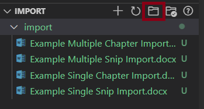
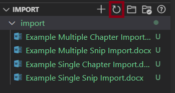
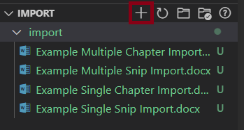
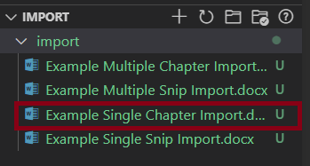

 

## First click here to open the imports folder.  This is where all documents you'd like to import should be stored.  Dump everything you want to import here.

## Once all imports are added, hit the refresh button to add them to the GUI.

 

## Hit the plus button to import all documents at once.

 

## Click on any single document to import only that one.  Or click on a folder to import all documents in that folder.